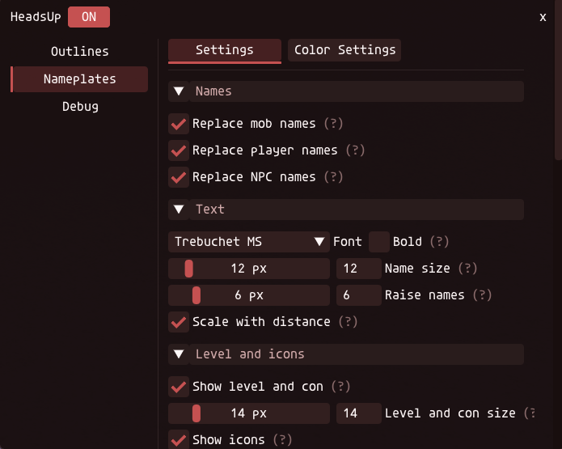
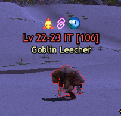
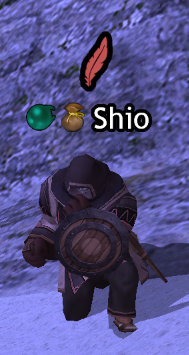

# HeadsUp

An Ashita v4 plugin for Final Fantasy XI on PhoenixXI. It outlines nearby monsters in a color that tells you whether
they will attack you, and replaces the game's nameplates with clearer ones: names, level and con, how a monster
detects you, player status icons and a target cursor. It only reads what the game already shows and the server
already sends; it never targets or checks anything itself.

Download `headsup.dll` from the latest release on the [Releases](https://github.com/Tanyrus/headsup/releases) page and
put it in Ashita's `plugins` folder. Load it with `/load headsup`; `/hu` opens its settings.

> **About the data:** HeadsUp's monster data (levels, aggression, links and detection) is built from Phoenix's own
> server code: the map server is compiled from Phoenix's public source and records every monster it loads. It matches
> the Phoenix version it was built from, so a monster changed on the live server since then can show the wrong color,
> level or icons.

## Aggro outlines

Each monster gets a colored border, from Phoenix's own mob data and your level:

| Border | Meaning |
|---|---|
| Red | Will attack you |
| Green | Won't attack you, or is too weak to bother you |
| Gold-orange | A notorious monster that will attack you |
| Gold | A notorious monster that won't |
| Purple | A lottery placeholder for a notorious monster |
| Gray | Not in the mob data |

Green and gray are off until you turn them on in the settings.

## Nameplates

Above a monster's name: a row of icons (aggressive or passive, links, and how it detects you: sight, true sight,
sound, scent, magic, job abilities, low HP) and its level and con, colored like `/check`. After you `/check` it, the
line shows its exact level for that spawn. With mob IDs turned on, a placeholder shows `[PH]` on its level line, and
an optional timer above your name counts down to the respawn of each placeholder you see die.

Players get XIUI's HQ status icons beside their names: seeking party, bazaar, linkshell in its color, away, mentor,
new adventurer, GM and level sync. Each icon can sit left or right of the name, or be hidden. The names of players
sitting, resting or in a chair are lowered to their heads.

Your target gets a bobbing arrow, or Phoenix's feather, in place of the game's cursor: one color for your target,
another while locked on, and another for the sub-target you are picking.

It can also put PlayOnline's chocobo back as your mouse pointer, the one the PlayOnline Viewer had.

Every part has its own switch, and fonts, sizes and colors are in the settings.
